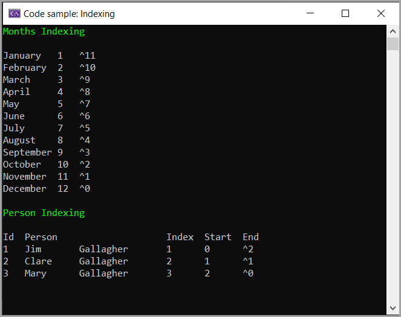

# About

Code samples for [Indices and ranges](https://learn.microsoft.com/en-us/dotnet/csharp/tutorials/ranges-indexes). More samples to follow.



Example code for above

```csharp
private static void MonthsIndexing()
{
    Print();

    List<ElementContainer<string>> monthContainer = RangeDetails(MonthNames());
    foreach (var item in monthContainer)
    {
        Console.WriteLine($"{item.Value,-10}{item.Index,-4}{item.EndIndex}");
    }
}
private static void PersonIndexing()
{
    Print();
    List<Person> people = new()
    {
        new() { Id = 1, FirstName = "Jim", LastName = "Gallagher"},
        new () { Id = 2, FirstName = "Clare", LastName = "Gallagher"},
        new () { Id = 3, FirstName = "Mary", LastName = "Gallagher"}
    };

    var personContainer = RangeDetails(people);
    Console.WriteLine($"Id  Person                    Index  Start  End");
    foreach (var item in personContainer)
    {
        Console.WriteLine($"{item.Value,-10} {item.Index,-4} {item.StartIndex,3} {item.EndIndex,7}");
    }
}
```

Class to get indices

```csharp
class Helpers
{
    public static List<ElementContainer<T>> RangeDetails<T>(List<T> list) =>
        list.Select((element, index) => new ElementContainer<T>
        {
            Value = element,
            StartIndex = new Index(index),
            EndIndex = new Index(Enumerable.Range(0, list.Count).Reverse().ToList()[index], true),
            Index = index + 1
        }).ToList();
}
```

Model

```csharp
public class ElementContainer<T>
{
    public T Value { get; set; }
    public Index StartIndex { get; set; }
    public Index EndIndex { get; set; }
    public int Index { get; set; }
    public override string ToString() => $"{Index,-5:D2}{Value}";
}
```